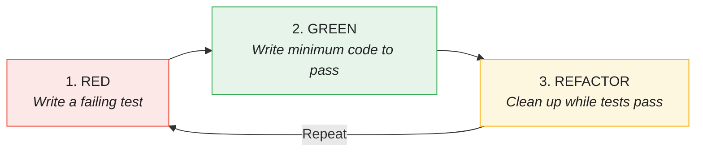

# Test-Driven Development in Tattva

This document explains the TDD practices, testing strategies, and patterns used throughout the Tattva codebase.

---

## The TDD Workflow

Every feature in Tattva is developed following the **Red-Green-Refactor** cycle:



---

## Test Pyramid

Tattva follows the test pyramid with emphasis on unit tests:

<p align="center">
  
</p>

### Test Categories

| Category | Location | Description |
|----------|----------|-------------|
| **Unit** | `StreamingCoreTests/` | Test single units with mocks |
| **iOS Unit** | `StreamingCoreiOSTests/` | Test UI components |
| **Integration** | `TattvaTests/` | Test composed systems |
| **tvOS** | `TattvaTVTests/` | Test tvOS feed & player UI (see [Apple TV](features/APPLE-TV.md)) |
| **API E2E** | `StreamingCoreAPIEndToEndTests/` | Test against real API |
| **Cache Integration** | `StreamingCoreCacheIntegrationTests/` | Test real CoreData |

> **Note:** The AVFoundation playback types (`AVPlayerVideoPlayer`, `StatefulVideoPlayer`) live in the `StreamingCorePlayback` framework but have no dedicated test target — they are exercised from `TattvaTests` (`AVPlayerVideoPlayerTests`, `StatefulVideoPlayerTests`, `StatefulVideoPlayerIntegrationTests`).

---

## Test Naming Convention

All tests follow the pattern:

```
test_[subject]_[scenario]_[expected outcome]
```

### Examples:

```swift
func test_init_startsInIdleState()
func test_sendLoad_fromIdle_transitionsToLoading()
func test_sendPlay_fromReady_transitionsToPlaying()
func test_sendPlay_fromIdle_isRejected()
func test_map_deliversItemsOn200HTTPResponseWithJSONItems()
func test_formatTime_returnsZeroForInvalidTime()
```

---

## Memory Leak Detection

Every test helper includes memory leak tracking:

```swift
private func makeSUT(
    file: StaticString = #filePath,
    line: UInt = #line
) -> SUT {
    let sut = SUT()
    trackForMemoryLeaks(sut, file: file, line: line)
    return sut
}
```

### XCTestCase Extension

**File:** `StreamingCoreTests/Helpers/XCTestCase+MemoryLeakTracking.swift`

```swift
extension XCTestCase {
    func trackForMemoryLeaks(
        _ instance: AnyObject,
        file: StaticString = #filePath,
        line: UInt = #line
    ) {
        addTeardownBlock { [weak instance] in
            XCTAssertNil(
                instance,
                "Instance should have been deallocated. Potential memory leak.",
                file: file,
                line: line
            )
        }
    }
}
```

---

## UI Test Cleanup

UIKit defers view and constraint deallocation to the main run loop. Draining it in `tearDown` lets that cleanup finish before the next test's `setUp` runs:

```swift
@MainActor
final class MyUITests: XCTestCase {
    override func tearDown() {
        super.tearDown()
        RunLoop.current.run(until: Date())
    }
}
```

**Why keep it?** It guards a real UIKit behavior — deferred dealloc colliding with the next test's `setUp`. The malloc crash it originally prevented no longer reproduces on Xcode 26.6 / Swift 6.3.3: removing every teardown drain and running the UI suites in sequence (828 executions) produced zero crashes — that crash was the Swift 6 deinit-isolation bug in [Common Pitfalls #1](#1-swift-6-mainactor-deallocation-crash-historical--fixed-in-the-current-toolchain), which is now fixed. The drain is retained anyway: it costs nothing at runtime and the deferred-dealloc collision is a real, timing-dependent hazard, so it stays as cheap insurance rather than a load-bearing workaround.

---

## Test Double Selection

| Scenario | Pattern | Example |
|----------|---------|---------|
| Synchronous spy in UI test | `@MainActor final class Spy` | ViewControllerSpy |
| Async operations | `actor Spy` | AsyncLoaderSpy |
| Cross-actor shared state | `@unchecked Sendable + NSLock` | ResourceCleanerSpy |
| Simple stub | `struct Stub` | HTTPClientStub |

### Thread-Safe Spy Pattern

```swift
final class ResourceCleanerSpy: ResourceCleaner, @unchecked Sendable {
    private let lock = NSLock()
    private var _cleanupCallCount = 0

    var cleanupCallCount: Int {
        lock.lock()
        defer { lock.unlock() }
        return _cleanupCallCount
    }

    func cleanup() {
        lock.lock()
        _cleanupCallCount += 1
        lock.unlock()
    }
}
```

### Async Loader Spy

The `VideoLoader` boundary is `async throws`, so its spy is backed by an `AsyncThrowingStream` and awaited from `async` test methods:

```swift
@MainActor
final class LoaderSpy {
    private let requests = LoaderSpy<Void, Paginated<Video>>()

    var loadCallCount: Int { requests.count }

    func load() async throws -> Paginated<Video> {
        try await requests.load(())
    }

    func completeLoading(with videos: [Video] = [], at index: Int = 0) async {
        await requests.complete(with: Paginated(items: videos), at: index)
    }
}
```

---

## Async Test Patterns

### Testing Code That Spawns Tasks

```swift
func test_action_triggersAsyncBehavior() async {
    let sut = makeSUT()

    sut.performAction()
    await Task.yield()  // Let spawned Tasks run

    // Assert on results
}
```

### Testing Publishers

```swift
func test_statePublisher_emitsStateChanges() {
    let sut = makeSUT()
    var receivedStates: [PlaybackState] = []

    let cancellable = sut.statePublisher.sink { state in
        receivedStates.append(state)
    }

    sut.send(.load(anyURL()))
    sut.send(.didBecomeReady)

    XCTAssertEqual(receivedStates, [.idle, .loading(anyURL()), .ready])

    cancellable.cancel()
}
```

---

## Testing Pure Functions

Pure functions require no mocks - just input and assertions:

### Mapper Tests

```swift
func test_map_deliversItemsOn200HTTPResponseWithJSONItems() throws {
    let item1 = makeItem(id: UUID(), title: "a title")
    let json = makeItemsJSON([item1.json])

    let result = try VideoItemsMapper.map(json, from: HTTPURLResponse(statusCode: 200))

    XCTAssertEqual(result, [item1.model])
}

func test_map_throwsOnNon200HTTPResponse() {
    let json = makeItemsJSON([])

    XCTAssertThrowsError(
        try VideoItemsMapper.map(json, from: HTTPURLResponse(statusCode: 400))
    )
}
```

### Presenter Tests

```swift
func test_formatTime_returnsMinutesAndSeconds() {
    XCTAssertEqual(VideoPlayerPresenter.formatTime(0), "0:00")
    XCTAssertEqual(VideoPlayerPresenter.formatTime(59), "0:59")
    XCTAssertEqual(VideoPlayerPresenter.formatTime(60), "1:00")
    XCTAssertEqual(VideoPlayerPresenter.formatTime(125), "2:05")
}

func test_formatTime_returnsHoursMinutesSeconds() {
    XCTAssertEqual(VideoPlayerPresenter.formatTime(3600), "1:00:00")
    XCTAssertEqual(VideoPlayerPresenter.formatTime(7325), "2:02:05")
}

func test_formatTime_returnsZeroForInvalidTime() {
    XCTAssertEqual(VideoPlayerPresenter.formatTime(TimeInterval.nan), "0:00")
    XCTAssertEqual(VideoPlayerPresenter.formatTime(TimeInterval.infinity), "0:00")
}
```

---

## State Machine Testing

State machines are exhaustively tested with every valid transition:

```swift
@MainActor
final class DefaultPlaybackStateMachineTests: XCTestCase {

    // MARK: - Initial State

    func test_init_startsInIdleState() {
        let sut = makeSUT()
        XCTAssertEqual(sut.currentState, .idle)
    }

    // MARK: - Loading Transitions

    func test_sendLoad_fromIdle_transitionsToLoading() {
        let sut = makeSUT()
        let url = anyURL()

        let transition = sut.send(.load(url))

        XCTAssertEqual(sut.currentState, .loading(url))
        XCTAssertEqual(transition?.from, .idle)
        XCTAssertEqual(transition?.to, .loading(url))
    }

    // MARK: - Invalid Transitions

    func test_sendPlay_fromIdle_isRejected() {
        let sut = makeSUT()

        let transition = sut.send(.play)

        XCTAssertEqual(sut.currentState, .idle)  // State unchanged
        XCTAssertNil(transition)  // No transition occurred
    }

    // MARK: - Time Control

    func test_transition_containsCorrectTimestamp() {
        let fixedDate = Date()
        let sut = makeSUT(currentDate: { fixedDate })

        let transition = sut.send(.load(anyURL()))

        XCTAssertEqual(transition?.timestamp, fixedDate)
    }
}
```

---

## Integration Testing

Integration tests verify composed systems work together:

```swift
final class VideosUIIntegrationTests: XCTestCase {

    func test_loadActions_requestVideosFromLoader() async {
        let (sut, loader) = makeSUT()

        sut.simulateAppearance()

        XCTAssertEqual(loader.loadCallCount, 1)
    }

    func test_loadCompletion_rendersSuccessfullyLoadedVideos() async {
        let (sut, loader) = makeSUT()
        let video0 = makeVideo(title: "Video 1")
        let video1 = makeVideo(title: "Video 2")

        sut.simulateAppearance()
        loader.complete(with: [video0, video1])

        XCTAssertEqual(sut.numberOfRenderedVideos, 2)
        XCTAssertEqual(sut.videoTitle(at: 0), "Video 1")
        XCTAssertEqual(sut.videoTitle(at: 1), "Video 2")
    }
}
```

---

## End-to-End Testing

E2E tests verify the system works with real infrastructure:

```swift
final class StreamingCoreAPIEndToEndTests: XCTestCase {

    func test_endToEndServerGETVideosResult_matchesFixedTestAccountData() async throws {
        let receivedVideos = try await getVideosResult()

        XCTAssertEqual(receivedVideos.count, 10)
        XCTAssertEqual(receivedVideos[0].title, "Big Buck Bunny")
    }

    private func getVideosResult() async throws -> [Video] {
        let client = URLSessionHTTPClient(session: URLSession(configuration: .ephemeral))
        let (data, response) = try await client.get(from: videosTestServerURL)
        return try VideoItemsMapper.map(data, from: response)
    }
}
```

---

## Test Helpers

### Factory Methods

```swift
private func makeSUT(
    currentDate: @escaping () -> Date = Date.init,
    file: StaticString = #filePath,
    line: UInt = #line
) -> DefaultPlaybackStateMachine {
    let sut = DefaultPlaybackStateMachine(currentDate: currentDate)
    trackForMemoryLeaks(sut, file: file, line: line)
    return sut
}

private func anyURL() -> URL {
    URL(string: "https://any-url.com")!
}

private func makeVideo(
    id: UUID = UUID(),
    title: String = "any title"
) -> Video {
    Video(id: id, title: title, description: "", url: anyURL(), thumbnailURL: anyURL(), duration: 0)
}
```

### JSON Helpers

```swift
private func makeItemsJSON(_ items: [[String: Any]]) -> Data {
    let json = ["videos": items]
    return try! JSONSerialization.data(withJSONObject: json)
}

private func makeItem(id: UUID, title: String) -> (model: Video, json: [String: Any]) {
    let model = Video(id: id, title: title, ...)
    let json: [String: Any] = [
        "id": id.uuidString,
        "title": title,
        // ...
    ]
    return (model, json)
}
```

---

## Common Pitfalls & Solutions

### 1. Swift 6 @MainActor Deallocation Crash (historical — fixed in the current toolchain)

**Problem (historical):** malloc crash during `@MainActor` class deallocation, from a Swift runtime deinit-isolation bug ([swiftlang/swift#87316](https://github.com/swiftlang/swift/issues/87316)).

**Status (verified 2026-07-26):** No longer reproduces on Xcode 26.6 / Swift 6.3.3 (~2,500 dealloc-heavy test executions under `MainActor`-by-default, zero crashes).

**Current standard:**
1. Keep `SWIFT_DEFAULT_ACTOR_ISOLATION = nonisolated` — the correct Swift 6 default, no longer a crash workaround
2. Add explicit `@MainActor` where needed
3. Keep `RunLoop.current.run(until: Date())` in tearDown — it fixes a **separate** UIKit teardown double-free (see *Malloc Error Prevention*), not the runtime bug above

### 2. Fire-and-Forget Analytics in Decorators

**Problem:** A `@MainActor` decorator that captured `self` inside a `Task` crashed on deallocation (deinit-isolation runtime bug).

**Solution:** Don't capture `self`. Hoist the `Sendable` dependency into a local and let a structured `Task` capture only that — no retain, no isolated-deinit hazard, and the task keeps its priority and context (unlike `Task.detached`):

```swift
func play() {
    decoratee.play()
    let position = currentTime
    let logger = analyticsLogger
    Task { await logger.log(.play, position: position) }
}
```

### 3. Testing Async Publishers

**Problem:** Publisher emits after test completes.

**Solution:** Use expectations or synchronous collection:

```swift
func test_publisher_emitsValues() {
    let sut = makeSUT()
    var values: [Int] = []

    let cancellable = sut.publisher
        .sink { values.append($0) }

    sut.emit(1)
    sut.emit(2)

    XCTAssertEqual(values, [1, 2])

    cancellable.cancel()
}
```

---

## Test Coverage Focus

- **Presenters** - Business logic and state management
- **Use Cases** - Loading, caching, validation flows
- **Mappers** - JSON parsing and data transformation
- **State Machines** - Every state transition
- **View Controllers** - User interaction handling
- **Composers** - Dependency wiring

---

## Related Documentation

- [Architecture](ARCHITECTURE.md) - Testing at each layer
- [Dependency Rejection](DEPENDENCY-REJECTION.md) - Testing pure functions
- [State Machines](STATE-MACHINES.md) - State transition testing
- [SOLID Principles](SOLID.md) - Testable design

---

## References

- [Test Driven Development: By Example - Kent Beck](https://www.amazon.com/Test-Driven-Development-Kent-Beck/dp/0321146530)
- [Growing Object-Oriented Software, Guided by Tests](https://www.amazon.com/Growing-Object-Oriented-Software-Guided-Tests/dp/0321503627)
