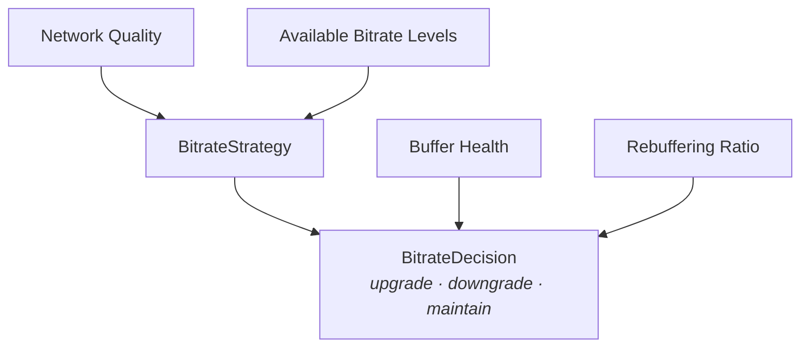

# Adaptive Bitrate (ABR) Feature

The Adaptive Bitrate types model quality selection based on network conditions, buffer health, and rebuffering ratio.

> **Runtime integration status.** The app streams HLS (`.m3u8`), and **AVFoundation performs adaptive bitrate selection natively** over the multivariant renditions. The `BitrateStrategy` / `BitrateLevel` / `BitrateDecision` types described below are **implemented and unit-tested**, but they do **not** drive rendition selection for HLS — doing so would duplicate and fight AVFoundation's own ABR. Their active runtime roles are narrower and honest: the bandwidth estimator is fed from `AVPlayerItemAccessLog.observedBitrate` for **observability/telemetry**, and `PlaybackCoordinator.setPreferredPeakBitRate(_:)` applies a **live maximum-bitrate cap** — driven at runtime by `NetworkBitratePolicy` off `NetworkQualityMonitor` (≈600 kbps / 1.5 Mbps / 3 Mbps / uncapped by network quality) in the composer's network sink on **both** platforms. Treat the strategy logic here as a tested component available for a custom-ABR or non-HLS scenario, not as the active ABR driver. These types are platform-agnostic — the strategy lives in `StreamingCore` and the estimator/cap in `StreamingCorePlayback` — so this applies equally to the iOS app and the tvOS app (see [Apple TV](APPLE-TV.md)).

---

## Overview



---

## Features

- **Network-Aware Selection** - Initial bitrate based on connection quality
- **Buffer Health Monitoring** - Upgrade when buffer is healthy
- **Rebuffering Response** - Immediate downgrade on stalls
- **Strategy Pattern** - Swappable selection algorithms
- **Standard Quality Levels** - Pre-defined 360p to 4K options
- **Conservative Default** - Prioritizes smooth playback over max quality

---

## Architecture

### BitrateLevel

**File:** `StreamingCore/StreamingCore/Video Performance Feature/BitrateLevel.swift`

```swift
public struct BitrateLevel: Equatable, Sendable, Comparable {
    public let bitrate: Int
    public let label: String

    public init(bitrate: Int, label: String) {
        self.bitrate = bitrate
        self.label = label
    }

    public static func < (lhs: BitrateLevel, rhs: BitrateLevel) -> Bool {
        lhs.bitrate < rhs.bitrate
    }

    /// Standard bitrate levels for common video qualities
    public static let standardLevels: [BitrateLevel] = [
        BitrateLevel(bitrate: 500_000, label: "360p"),
        BitrateLevel(bitrate: 1_000_000, label: "480p"),
        BitrateLevel(bitrate: 2_500_000, label: "720p"),
        BitrateLevel(bitrate: 5_000_000, label: "1080p"),
        BitrateLevel(bitrate: 15_000_000, label: "4K")
    ]
}
```

### Standard Quality Levels

| Quality | Bitrate | Description |
|---------|---------|-------------|
| 360p | 500 Kbps | Low quality, minimal bandwidth |
| 480p | 1 Mbps | Standard definition |
| 720p | 2.5 Mbps | HD quality |
| 1080p | 5 Mbps | Full HD |
| 4K | 15 Mbps | Ultra HD |

---

## BitrateStrategy Protocol

**File:** `StreamingCore/StreamingCore/Video Performance Feature/BitrateStrategy.swift`

```swift
public protocol BitrateStrategy: Sendable {
    /// Determine initial bitrate based on network quality
    func initialBitrate(
        for networkQuality: NetworkQuality,
        availableLevels: [BitrateLevel]
    ) -> Int

    /// Determine if bitrate should be upgraded
    func shouldUpgrade(
        currentBitrate: Int,
        bufferHealth: Double,
        networkQuality: NetworkQuality,
        availableLevels: [BitrateLevel]
    ) -> Int?

    /// Determine if bitrate should be downgraded
    func shouldDowngrade(
        currentBitrate: Int,
        rebufferingRatio: Double,
        networkQuality: NetworkQuality,
        availableLevels: [BitrateLevel]
    ) -> Int?
}
```

---

## ConservativeBitrateStrategy

**File:** `StreamingCore/StreamingCore/Video Performance Feature/ConservativeBitrateStrategy.swift`

```swift
public struct ConservativeBitrateStrategy: BitrateStrategy, Sendable {
    private let bufferHealthThreshold: Double  // Default: 0.7
    private let rebufferingThreshold: Double   // Default: 0.05

    public init(
        bufferHealthThreshold: Double = 0.7,
        rebufferingThreshold: Double = 0.05
    ) {
        self.bufferHealthThreshold = bufferHealthThreshold
        self.rebufferingThreshold = rebufferingThreshold
    }
}
```

### Initial Bitrate Selection

```swift
public func initialBitrate(
    for networkQuality: NetworkQuality,
    availableLevels: [BitrateLevel]
) -> Int {
    let sortedLevels = availableLevels.sorted()
    let index: Int

    switch networkQuality {
    case .offline, .poor:
        index = 0                          // Lowest quality
    case .fair:
        index = sortedLevels.count / 3     // Lower third
    case .good:
        index = sortedLevels.count * 2 / 3 // Upper third
    case .excellent:
        index = sortedLevels.count - 1     // Highest quality
    }

    return sortedLevels[index].bitrate
}
```

### Upgrade Logic

```swift
public func shouldUpgrade(
    currentBitrate: Int,
    bufferHealth: Double,
    networkQuality: NetworkQuality,
    availableLevels: [BitrateLevel]
) -> Int? {
    // Don't upgrade on poor network
    guard networkQuality >= .fair else { return nil }

    // Don't upgrade if buffer health is low
    guard bufferHealth >= bufferHealthThreshold else { return nil }

    // Find next higher level
    let sortedLevels = availableLevels.sorted()
    guard let currentIndex = sortedLevels.firstIndex(where: { $0.bitrate >= currentBitrate }),
          currentIndex + 1 < sortedLevels.count else {
        return nil
    }

    // Allow upgrade on good network with healthy buffer
    if networkQuality >= .good && bufferHealth >= bufferHealthThreshold {
        return sortedLevels[currentIndex + 1].bitrate
    }

    return nil
}
```

### Downgrade Logic

```swift
public func shouldDowngrade(
    currentBitrate: Int,
    rebufferingRatio: Double,
    networkQuality: NetworkQuality,
    availableLevels: [BitrateLevel]
) -> Int? {
    let sortedLevels = availableLevels.sorted()

    guard let currentIndex = sortedLevels.firstIndex(where: { $0.bitrate >= currentBitrate }),
          currentIndex > 0 else {
        return nil  // Already at lowest
    }

    // Downgrade immediately on rebuffering
    if rebufferingRatio >= rebufferingThreshold {
        return sortedLevels[currentIndex - 1].bitrate
    }

    // Downgrade on poor network
    if networkQuality <= .poor {
        return sortedLevels[currentIndex - 1].bitrate
    }

    return nil
}
```

---

## Network Quality to Bitrate Mapping

| Network Quality | Initial Selection | Can Upgrade |
|-----------------|-------------------|-------------|
| Offline | Lowest (360p) | No |
| Poor | Lowest (360p) | No |
| Fair | Lower third (480p) | No |
| Good | Upper third (720p) | Yes |
| Excellent | Highest (1080p/4K) | Yes |

---

## Decision Factors

### Upgrade Conditions
All must be true:
- Network quality >= Fair
- Buffer health >= 70%
- Higher quality level available

### Downgrade Triggers
Any of these:
- Rebuffering ratio >= 5%
- Network quality <= Poor

---

## Usage Example

```swift
let strategy = ConservativeBitrateStrategy()
let availableLevels = BitrateLevel.standardLevels

// Initial selection
let initialBitrate = strategy.initialBitrate(
    for: .good,
    availableLevels: availableLevels
)
// Returns: 2_500_000 (720p)

// Check for upgrade
if let newBitrate = strategy.shouldUpgrade(
    currentBitrate: 2_500_000,
    bufferHealth: 0.85,
    networkQuality: .excellent,
    availableLevels: availableLevels
) {
    // Upgrade to 5_000_000 (1080p)
    player.preferredPeakBitRate = Double(newBitrate)
}

// Check for downgrade
if let newBitrate = strategy.shouldDowngrade(
    currentBitrate: 2_500_000,
    rebufferingRatio: 0.08,
    networkQuality: .fair,
    availableLevels: availableLevels
) {
    // Downgrade to 1_000_000 (480p)
    player.preferredPeakBitRate = Double(newBitrate)
}
```

---

## Integration with AVPlayer

```swift
@MainActor
func applyBitrateDecision(_ bitrate: Int, to player: AVPlayer) {
    player.currentItem?.preferredPeakBitRate = Double(bitrate)
}

// Continuous monitoring
func monitorAndAdaptBitrate() {
    Timer.scheduledTimer(withTimeInterval: 5.0, repeats: true) { [weak self] _ in
        guard let self = self else { return }

        let bufferHealth = calculateBufferHealth()
        let rebufferingRatio = rebufferingMonitor.state.totalBufferingDuration / totalPlaybackTime

        if let upgrade = strategy.shouldUpgrade(
            currentBitrate: currentBitrate,
            bufferHealth: bufferHealth,
            networkQuality: networkMonitor.currentQuality,
            availableLevels: availableLevels
        ) {
            currentBitrate = upgrade
            applyBitrateDecision(upgrade, to: player)
        } else if let downgrade = strategy.shouldDowngrade(
            currentBitrate: currentBitrate,
            rebufferingRatio: rebufferingRatio,
            networkQuality: networkMonitor.currentQuality,
            availableLevels: availableLevels
        ) {
            currentBitrate = downgrade
            applyBitrateDecision(downgrade, to: player)
        }
    }
}
```

---

## Testing

### Unit Tests

```swift
func test_initialBitrate_excellentNetwork_returnsHighest() {
    let sut = ConservativeBitrateStrategy()

    let bitrate = sut.initialBitrate(
        for: .excellent,
        availableLevels: BitrateLevel.standardLevels
    )

    XCTAssertEqual(bitrate, 15_000_000) // 4K
}

func test_shouldUpgrade_goodNetworkHighBuffer_returnsNextLevel() {
    let sut = ConservativeBitrateStrategy()

    let newBitrate = sut.shouldUpgrade(
        currentBitrate: 2_500_000,
        bufferHealth: 0.85,
        networkQuality: .excellent,
        availableLevels: BitrateLevel.standardLevels
    )

    XCTAssertEqual(newBitrate, 5_000_000) // 720p -> 1080p
}

func test_shouldDowngrade_highRebuffering_returnsPreviousLevel() {
    let sut = ConservativeBitrateStrategy()

    let newBitrate = sut.shouldDowngrade(
        currentBitrate: 2_500_000,
        rebufferingRatio: 0.10,
        networkQuality: .fair,
        availableLevels: BitrateLevel.standardLevels
    )

    XCTAssertEqual(newBitrate, 1_000_000) // 720p -> 480p
}

func test_shouldUpgrade_lowBuffer_returnsNil() {
    let sut = ConservativeBitrateStrategy()

    let newBitrate = sut.shouldUpgrade(
        currentBitrate: 2_500_000,
        bufferHealth: 0.4,  // Below threshold
        networkQuality: .excellent,
        availableLevels: BitrateLevel.standardLevels
    )

    XCTAssertNil(newBitrate) // No upgrade when buffer low
}
```

---

## Related Documentation

- [Network Quality](NETWORK-QUALITY.md) - Network monitoring
- [Buffer Management](BUFFER-MANAGEMENT.md) - Buffer health calculation
- [Rebuffering Detection](REBUFFERING-DETECTION.md) - Stall tracking
- [Performance](../PERFORMANCE.md) - Performance optimization strategies
