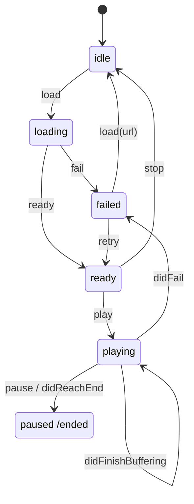
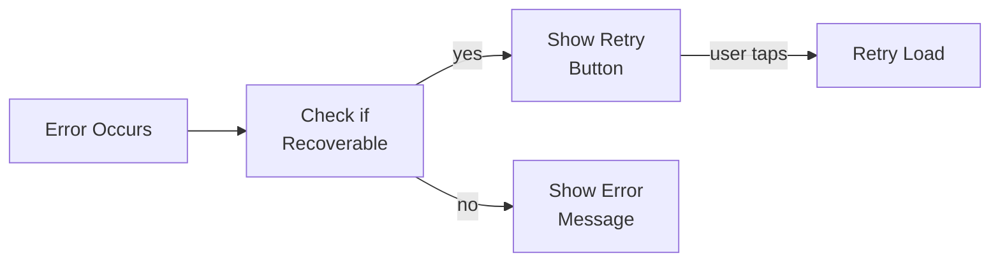

# Video Playback Feature

The Video Playback feature provides a full-featured video player with state management, controls, and multiple playback options.

---

## Overview

<p align="center">
  
</p>

---

## Features

- **Play/Pause** - Toggle video playback
- **Seek** - Jump forward/backward 10 seconds or drag progress bar
- **Volume Control** - Adjust volume with slider and mute toggle
- **Playback Speed** - 0.5x, 1x, 1.25x, 1.5x, 2x speeds
- **Fullscreen Mode** - Landscape fullscreen with orientation support
- **Picture-in-Picture** - Continue watching in floating window
- **Auto-hiding Controls** - Controls fade after inactivity
- **State Machine** - Predictable state transitions

---

## Architecture

> **Platform scope:** The playback core is platform-agnostic. The state machine (`StreamingCore/Video Playback Feature`) and AVPlayer plumbing (`StreamingCorePlayback`: `AVPlayerVideoPlayer`, `StatefulVideoPlayer`, adapters) are shared by both the iOS and tvOS apps. Only the **UI Components** section below (`StreamingCoreiOS`) is iOS-specific; the tvOS app has its own player UI. See [Apple TV](APPLE-TV.md).

### VideoPlayer Protocol

**File:** `StreamingCore/StreamingCore/Video Playback Feature/VideoPlayer.swift`

```swift
@MainActor
public protocol VideoPlayer: AnyObject {
    var isPlaying: Bool { get }
    var currentTime: TimeInterval { get }
    var duration: TimeInterval { get }
    var volume: Float { get }
    var isMuted: Bool { get }
    var playbackSpeed: Float { get }

    func load(url: URL)
    func play()
    func pause()
    func seekForward(by seconds: TimeInterval)
    func seekBackward(by seconds: TimeInterval)
    func seek(to time: TimeInterval)
    func setVolume(_ volume: Float)
    func toggleMute()
    func setPlaybackSpeed(_ speed: Float)
}
```

### PlaybackState Enum

**File:** `StreamingCore/StreamingCore/Video Playback Feature/PlaybackState.swift`

```swift
public enum PlaybackState: Equatable, Sendable {
    case idle
    case loading(URL)
    case ready
    case playing
    case paused
    case buffering(previousState: ResumableState)
    case seeking(to: TimeInterval, previousState: ResumableState)
    case ended
    case failed(PlaybackError)

    public enum ResumableState: Equatable, Sendable {
        case playing
        case paused
    }

    public var isActive: Bool { ... }
    public var canPlay: Bool { ... }
    public var canPause: Bool { ... }
}
```

### PlaybackAction Enum

**File:** `StreamingCore/StreamingCore/Video Playback Feature/PlaybackAction.swift`

```swift
public enum PlaybackAction: Equatable, Sendable {
    // User Actions
    case load(URL)
    case play
    case pause
    case seek(to: TimeInterval)
    case stop
    case retry

    // System Events
    case didBecomeReady
    case didStartPlaying
    case didPause
    case didStartBuffering
    case didFinishBuffering
    case didStartSeeking
    case didFinishSeeking
    case didReachEnd
    case didFail(PlaybackError)

    // External Events
    case didEnterBackground
    case didBecomeActive
    case audioSessionInterrupted
    case audioSessionResumed
}
```

---

## State Machine

### State Transition Diagram



### DefaultPlaybackStateMachine

**File:** `StreamingCore/StreamingCore/Video Playback Feature/DefaultPlaybackStateMachine.swift`

```swift
@MainActor
public final class DefaultPlaybackStateMachine {
    private var _currentState: PlaybackState = .idle
    private let stateSubject = CurrentValueSubject<PlaybackState, Never>(.idle)
    private let transitionSubject = PassthroughSubject<PlaybackTransition, Never>()

    public var currentState: PlaybackState { _currentState }
    public var statePublisher: AnyPublisher<PlaybackState, Never> { ... }
    public var transitionPublisher: AnyPublisher<PlaybackTransition, Never> { ... }

    public func send(_ action: PlaybackAction) -> PlaybackTransition? {
        guard let nextState = nextState(for: action, from: _currentState) else {
            return nil  // Invalid transition
        }
        // Update state and publish
        return transition
    }

    public func canPerform(_ action: PlaybackAction) -> Bool {
        nextState(for: action, from: _currentState) != nil
    }
}
```

---

## UI Components

### VideoPlayerViewController

**File:** `StreamingCoreiOS/Video UI/Controllers/VideoPlayerViewController.swift`

Main controller managing:
- Player view (video rendering)
- Controls overlay
- Comments container
- Fullscreen transitions
- Orientation handling

### VideoPlayerControls

**File:** `StreamingCoreiOS/Video UI/Views/VideoPlayerControls.swift`

Owns and configures the control widgets and routes their target/action to
callbacks. It is not a view — `VideoPlayerViewController` parents each widget
onto its own root view — so it is an `NSObject` (required for the widgets'
target/action dispatch), not a `UIView`.

```swift
public final class VideoPlayerControls: NSObject {
    // Playback controls
    public let playPauseButton: UIButton
    public let seekForwardButton: UIButton
    public let seekBackwardButton: UIButton

    // Progress
    public let progressSlider: UISlider
    public let currentTimeLabel: UILabel
    public let durationLabel: UILabel

    // Audio
    public let muteButton: UIButton
    public let volumeSlider: UISlider

    // Options
    public let speedButton: UIButton
    public let fullscreenButton: UIButton
    public let pipButton: UIButton
}
```

### ControlsVisibilityController

**File:** `StreamingCoreiOS/Video UI/Controllers/ControlsVisibilityController.swift`

```swift
@MainActor
public final class ControlsVisibilityController {
    private let hideDelay: TimeInterval
    private var hideTimer: Timer?

    public var onVisibilityChange: ((Bool) -> Void)?

    public func showControls() {
        onVisibilityChange?(true)
        scheduleHide()
    }

    public func hideControls() {
        hideTimer?.invalidate()
        onVisibilityChange?(false)
    }

    public func toggleControls() {
        isVisible ? hideControls() : showControls()
    }

    private func scheduleHide() {
        hideTimer = Timer.scheduledTimer(withTimeInterval: hideDelay, repeats: false) { _ in
            self.hideControls()
        }
    }
}
```

---

## AVPlayer Implementation

### AVPlayerVideoPlayer

**File:** `StreamingCore/StreamingCorePlayback/AVPlayerVideoPlayer.swift`

```swift
public final class AVPlayerVideoPlayer: VideoPlayer {
    public let player: AVPlayer

    public func load(url: URL) {
        let playerItem = AVPlayerItem(url: url)
        player.replaceCurrentItem(with: playerItem)
    }

    public func play() {
        player.play()
        isPlaying = true
    }

    public func pause() {
        player.pause()
        isPlaying = false
    }

    public func seek(to time: TimeInterval) {
        let cmTime = CMTime(seconds: time, preferredTimescale: 600)
        player.seek(to: cmTime)
    }
}
```

### AVPlayerStateAdapter

**File:** `StreamingCore/StreamingCorePlayback/AVPlayerStateAdapter.swift`

Bridges AVPlayer KVO to state machine:

```swift
public final class AVPlayerStateAdapter {
    private weak var player: AVPlayer?
    private let actionHandler: (PlaybackAction) -> Void

    public func startObserving() {
        // Observe timeControlStatus
        player?.observe(\.timeControlStatus) { [weak self] player, _ in
            switch player.timeControlStatus {
            case .playing: self?.actionHandler(.didStartPlaying)
            case .paused: self?.actionHandler(.didPause)
            case .waitingToPlayAtSpecifiedRate: self?.actionHandler(.didStartBuffering)
            }
        }

        // Observe item status
        player?.observe(\.currentItem?.status) { [weak self] player, _ in
            if player.currentItem?.status == .readyToPlay {
                self?.actionHandler(.didBecomeReady)
            }
        }

        // Observe playback end
        NotificationCenter.default.addObserver(
            forName: .AVPlayerItemDidPlayToEndTime,
            object: nil,
            queue: .main
        ) { [weak self] _ in
            self?.actionHandler(.didReachEnd)
        }
    }
}
```

---

## Playback Speed

Available speeds:

| Speed | Use Case |
|-------|----------|
| 0.5x | Slow motion, detailed viewing |
| 1.0x | Normal playback |
| 1.25x | Slightly faster |
| 1.5x | Quick viewing |
| 2.0x | Fast forward |

```swift
public var playbackSpeed: Float = 1.0

public func setPlaybackSpeed(_ speed: Float) {
    playbackSpeed = speed
    player.rate = speed
}
```

---

## Error Handling

### PlaybackError

**File:** `StreamingCore/StreamingCore/Video Playback Feature/PlaybackError.swift`

```swift
public enum PlaybackError: Error, Equatable, Sendable {
    case loadFailed(reason: String)
    case networkError(reason: String)
    case decodingError(reason: String)
    case drmError(reason: String)
    case unknown(reason: String)

    public var isRecoverable: Bool {
        switch self {
        case .networkError: return true
        default: return false
        }
    }
}
```

### Recovery Flow



---

## Decorators

### StatefulVideoPlayer

**File:** `StreamingCore/StreamingCorePlayback/StatefulVideoPlayer.swift`

Wraps VideoPlayer with state machine:

```swift
@MainActor
public final class StatefulVideoPlayer: VideoPlayer {
    private let decoratee: VideoPlayer
    private let stateMachine: DefaultPlaybackStateMachine

    public var statePublisher: AnyPublisher<PlaybackState, Never> {
        stateMachine.statePublisher
    }

    public func play() {
        guard stateMachine.send(.play) != nil else { return }
        decoratee.play()
    }
}
```

### LoggingVideoPlayerDecorator

Adds structured logging to all operations.

### AnalyticsVideoPlayerDecorator

Tracks playback events for analytics.

---

## Testing

### State Machine Tests

```swift
@MainActor
func test_sendPlay_fromReady_transitionsToPlaying() {
    let sut = makeSUT()
    sut.send(.load(anyURL()))
    sut.send(.didBecomeReady)

    let transition = sut.send(.play)

    XCTAssertEqual(sut.currentState, .playing)
    XCTAssertEqual(transition?.from, .ready)
    XCTAssertEqual(transition?.to, .playing)
}

@MainActor
func test_sendPlay_fromIdle_isRejected() {
    let sut = makeSUT()

    let transition = sut.send(.play)

    XCTAssertEqual(sut.currentState, .idle)
    XCTAssertNil(transition)
}
```

---

## Related Documentation

- [State Machines](../STATE-MACHINES.md) - Detailed state machine design
- [Picture-in-Picture](PICTURE-IN-PICTURE.md) - PiP implementation
- [Analytics](ANALYTICS.md) - Playback tracking
- [Buffer Management](BUFFER-MANAGEMENT.md) - Adaptive buffering
